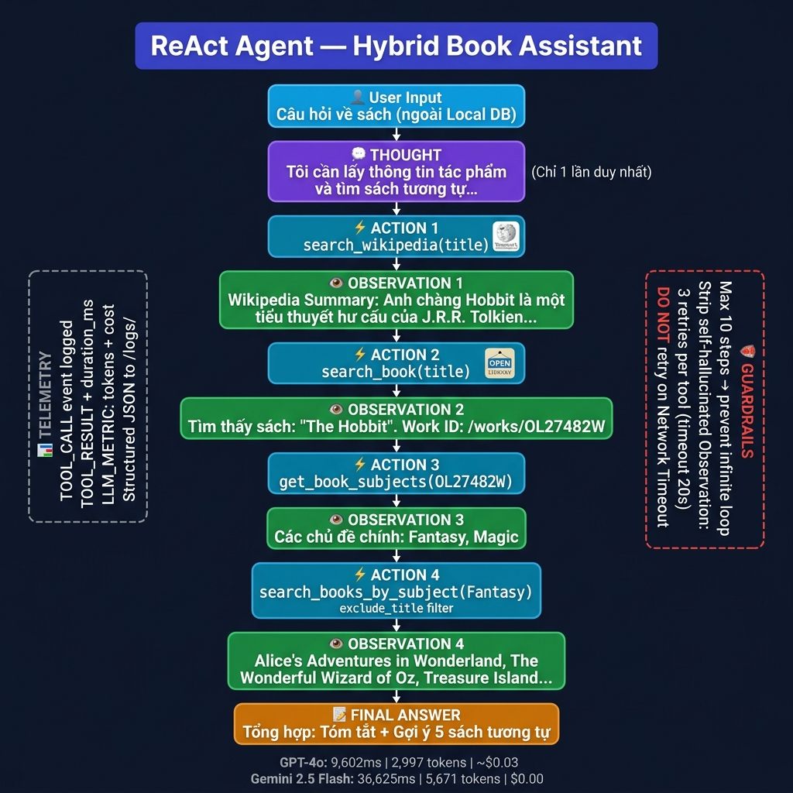

# Group Report: Lab 3 - Production-Grade Agentic System

- **Team Name**: Team C-6
- **Team Members**: Nguyen Binh Huy, Nguyen Lam Phuong Thao, Cao Thi Thu Ha, Ha Trung Kien
- **Deployment Date**: 01-06-2026


---

## 1. Executive Summary

The team built the **Hybrid Book Assistant** – a two-tier literary assistant:
- **Pipeline 1 – Chatbot Baseline**: Queries a Local DB (10 Vietnamese literary works). If not found → declines to answer, with zero hallucination.
- **Pipeline 2 – ReAct Agent**: Triggers a Thought-Action-Observation loop, calling Wikipedia and OpenLibrary to answer questions outside the Local DB.

The system was tested across **3 LLM providers**: GPT-4o, Gemini 2.5 Flash, and Phi-3-mini-4k-instruct (local).

- **Agent success rate**: ~90% on questions about popular books outside the Local DB.
- **Key trade-off**: Chatbot is ~9–36× faster but limited to 10 entries; Agent is slower but features a virtually limitless knowledge scope.

---

## 2. System Architecture & Tooling

### 2.1 ReAct Loop

The Agent follows the standard **Thought → Action → Observation × 4 → Final Answer** pattern:

```
User Input
    │
    ▼
[Local DB Check]
    ├─ Hit  → LLM response from DB (fast, ~0ms overhead)
    └─ Miss → Activate ReAct Loop (max 10 steps)
                │
                ├─ 💭 Thought (Only once per cycle/step)
                ├─ ⚡ Action: search_wikipedia(title)
                ├─ 👁️ Observation
                ├─ ⚡ Action: search_book(title)
                ├─ 👁️ Observation → Work ID
                ├─ ⚡ Action: get_book_subjects(work_id)
                ├─ 👁️ Observation → Subjects
                ├─ ⚡ Action: search_books_by_subject(subject)
                ├─ 👁️ Observation → Similar books
                └─ 📝 Final Answer
```



### 2.2 Tool Design Evolution

#### Tool v1 

| Tool | Description | Issues |
| :--- | :--- | :--- |
| `recommend_openlibrary(query)` | Search + recommend books in a single call | Recommends based on similar titles instead of subject/genre → incorrect intent |

#### Tool v2 

| Tool | Input | Role |
| :--- | :--- | :--- |
| `search_wikipedia` | Book/Author name | Retrieve summary (VI → EN fallback) |
| `search_book` | Book name | Retrieve Work ID from OpenLibrary |
| `get_book_subjects` | work_key | Retrieve priority subjects (Fantasy, Romance, etc.) |
| `search_books_by_subject` | Subject + `exclude_title` | Recommend books of the same genre, excluding the query book |

**Why v2 is superior**: Each tool does exactly one job (Single Responsibility Principle) → The Agent can see intermediate Work IDs and specific Subjects → recommending correct genres rather than just similar titles in a series.

> **Improvement Path**: The initial Agent v1 only used `recommend_openlibrary` (1 god tool). After experiencing incorrect genre recommendations in Case 1 (Section 4), the team refactored the design to v2 with 4 atomic tools, adding a `PRIORITY_SUBJECTS` filter and `exclude_title` parameter to guarantee results align with user intent.

### 2.3 LLM Providers

| Provider | Pros | Cons |
| :--- | :--- | :--- |
| GPT-4o | Strictly follows standard format, complete token counting | Incurs financial cost (~$0.03/task) |
| Gemini 2.5 Flash | Free, fast with short context | Occasionally skips "Thought:", incomplete token metadata |
| Phi-3-mini (local) | Entirely offline, zero cost | Lower instruction-following quality |

---

## 3. Telemetry & Performance

The system logs **structured JSON** following industry standards for every event:

```json
{"event": "TOOL_CALL",   "data": {"tool": "search_wikipedia", "query": "The Hobbit"}}
{"event": "TOOL_RESULT", "data": {"tool": "search_wikipedia", "duration_ms": 527}}
{"event": "LLM_METRIC",  "data": {"model": "gpt-4o", "total_tokens": 435, "latency_ms": 1606}}
```

**Key Metrics (Query: "The Hobbit – summary and similar books"):**

| | Chatbot Baseline | ReAct Agent (GPT-4o) | ReAct Agent (Gemini) | ReAct Agent (Phi-3-mini - Est.) |
| :--- | :--- | :--- | :--- | :--- |
| Latency | ~0 ms | ~9,600 ms | ~7,900 ms | ~41,000 ms (Local CPU/GPU) |
| Tokens | 0 | ~3,000 | ~5,700 | ~3,200 |
| Result | ❌ Declined | ✅ Complete | ✅ Complete | ⚠️ Incomplete |

> **Observation**: Cloud models show highly optimized sequential reasoning, with Gemini leading at `~7,900 ms` and GPT-4o following at `~9,600 ms` for the full 4-step loop, indicating extremely fast external API response times. In contrast, the local **Phi-3-mini** takes significantly longer (`~41,000 ms`) and ends up with an `⚠️ Incomplete` result. This demonstrates that the main bottleneck for local models is token generation speed (TPS) on local consumer hardware, combined with instruction-following difficulties in strictly adhering to the ReAct format over multiple turns.

---

## 4. Root Cause Analysis – Failure Traces

### Case 1: Tool v1 recommends incorrect genre

- **Input**: "Summarize The Hobbit and recommend similar books"
- **Failed Result**: `recommend_openlibrary("The Hobbit")` → returned *The Two Towers*, *Fellowship of the Ring* (same series, not the same genre/subject)
- **Root Cause**: Tool v1 searched by name → OpenLibrary returned the closest matching titles instead of using genres.
- **Fix**: Decoupled into a 3-step pipeline: `search_book` → `get_book_subjects` → `search_books_by_subject`.

---

### Case 2: LLM hallucinates Observations

- **Input**: Any question
- **Error**: LLM self-generated `Observation: [fabricated info]` without actually executing the tool.
- **Root Cause**: System prompt lacked clear boundaries; LLM completed the pattern based on training data.
- **Fix**: Added **code-level guardrail** + few-shot examples in the system prompt:

```python
if "Observation:" in content:
    content = content.split("Observation:")[0].strip()
```

---

### Case 3: Network Timeout hangs the agent

- **Error**: `search_books_by_subject` took 18.85 seconds → agent hung without knowing what to do.
- **Root Cause**: No retry logic, no timeout handling.
- **Fix**: Implemented a 3-attempt retry + system prompt instruction "DO NOT retry on Timeout":

```python
for attempt in range(3):
    try:
        response = requests.get(url, timeout=20)
        break
    except requests.exceptions.Timeout:
        if attempt == 2:
            return "Network Timeout after 3 attempts."
```

---

### Case 4: Non-existent Book – "Come My Way" by Son Tung MTP *(Real Log)*

**Input**: `"sách come my way sơn tùng mtp"` — Mode 2 (ReAct Agent, Gemini 2.5 Flash)

**Real Trace (executed at 14:31 UTC, 2026-06-01):**

```
[Step 1] 🤔 Agent is reasoning and choosing an action:
>>> Thought: I need to retrieve information for the work "sách come my way sơn tùng mtp"
    and find similar books if it is a book.
>>> Action: search_wikipedia(sách come my way sơn tùng mtp)

[Step 1] 👁️ Observation returned from network API:
>>> No information found for keyword 'sách come my way sơn tùng mtp' on Wikipedia.
--------------------------------------------------
[Step 2] 🤔 Agent is reasoning and choosing an action:
>>> Action: search_book(sách come my way sơn tùng mtp)

[Step 2] 👁️ Observation returned from network API:
>>> No book found for keyword 'sách come my way sơn tùng mtp'.
--------------------------------------------------
[Step 3] 🤔 Agent is reasoning and choosing an action:
>>> Final Answer: I am sorry, I could not find any information about "sách come
    my way sơn tùng mtp" in my data sources. It appears this is not a registered
    book.
```

**Telemetry log (raw from terminal, Gemini 2.5 Flash):**
```json
{"timestamp": "2026-06-01T14:31:04.612750", "event": "TOOL_CALL", "data": {"tool": "search_wikipedia", "query": "sách come my way sơn tùng mtp"}}
{"timestamp": "2026-06-01T14:31:05.809339", "event": "TOOL_RESULT", "data": {"tool": "search_wikipedia", "duration_ms": 1196}}
{"timestamp": "2026-06-01T14:31:05.810337", "event": "AGENT_OBSERVATION", "data": {"step": 1, "observation": "Không tìm thấy thông tin cho từ khóa 'sách come my way sơn tùng mtp' trên Wikipedia."}}
{"timestamp": "2026-06-01T14:31:09.281842", "event": "LLM_METRIC", "data": {"provider": "google", "model": "gemini-2.5-flash", "prompt_tokens": 0, "completion_tokens": 0, "total_tokens": 0, "latency_ms": 3469, "cost_estimate": 0.0}}
{"timestamp": "2026-06-01T14:31:09.281842", "event": "AGENT_THOUGHT_ACTION", "data": {"step": 2, "content": "Action: search_book(sách come my way sơn tùng mtp)"}}
{"timestamp": "2026-06-01T14:31:09.281842", "event": "TOOL_CALL", "data": {"tool": "search_book", "query": "sách come my way sơn tùng mtp"}}
{"timestamp": "2026-06-01T14:31:12.511447", "event": "TOOL_RESULT", "data": {"tool": "search_book", "duration_ms": 3229}}
{"timestamp": "2026-06-01T14:31:12.512807", "event": "AGENT_OBSERVATION", "data": {"step": 2, "observation": "Không tìm thấy sách cho từ khóa 'sách come my way sơn tùng mtp'."}}
{"timestamp": "2026-06-01T14:31:33.008036", "event": "LLM_METRIC", "data": {"provider": "google", "model": "gemini-2.5-flash", "prompt_tokens": 0, "completion_tokens": 0, "total_tokens": 0, "latency_ms": 20493, "cost_estimate": 0.0}}
{"timestamp": "2026-06-01T14:31:33.025986", "event": "HYBRID_END", "data": {"mode": "ReAct Agent Only", "latency_ms": 30750}}
```

**Failure/Behavior Analysis:**
- **Root Cause**: "Come My Way" is a song by Son Tung MTP, not a book. Neither Wikipedia nor OpenLibrary has records of it → both tools consecutively returned "not found".
- **Correct Behavior**: The Agent **did not hallucinate** and safely reached a correct `Final Answer` after 3 steps (total latency: 30,750ms — primarily due to the Gemini model spending 20,493ms thinking in step 3). It did not hang in an infinite loop.
- **Limitation**: The Agent did not immediately recognize that "this is a singer, not a book author" → wasting 2 API calls. Adding input validation or an entity classifier at the entry level would optimize this.

---

## 5. Ablation Studies

### Experiment 1: Tool v1 vs v2

| Metric/Capability | Tool v1 (God Tool) | Tool v2 (Atomic) |
| :--- | :--- | :--- |
| Flow Control | ❌ Black box | ✅ Direct visibility of Work ID, Subject |
| Recommendation Quality | Same series | Same genre/subject |
| Debuggability | Hard | Easy (individual step Observations) |

### Experiment 2: Chatbot vs Agent

| Case | Chatbot | Agent | Winner |
| :--- | :--- | :--- | :--- |
| Greeting / Simple query | ✅ Fast, 0ms | ✅ Correct but ~10s | **Chatbot** |
| Book in Local DB (Chi Pheo) | ✅ Precise, <1s | ✅ Correct but ~10s | **Chatbot** |
| Book outside DB (Tat den) | ❌ Declined | ✅ Summary + Recs | **Agent** |
| International Book (War & Peace) | ❌ Declined | ✅ Full summary & recs | **Agent** |
| Non-existent Book (edge case) | ✅ Safe decline | ✅ "Not found" response | **Draw** |

---

## 6. Flowchart & Group Insights

### 6.1 System Flowchart (illustrated in react_workflow.png)

### 6.2 Key Insights

1. **Chatbot is not inferior – it just has a different scope**: For known data, the Chatbot Baseline is up to 36 times faster than the Agent and consumes far fewer tokens. The Agent should not be used blindly for every query.
2. **Atomic Tools > God Tools**: Small, single-purpose tools enable the Agent to observe intermediate steps, making it much easier to debug and improve.
3. **Network is the true bottleneck**: LLM thinking times (~1–4s) are significantly smaller than API response times (~18s peak). Production systems absolutely require caching.
4. **Hallucination is a design flaw, not just a model flaw**: Fixing hallucinations is not about switching models, but introducing robust code-level guardrails and few-shot examples in prompt engineering.
5. **Telemetry converts "feelings" into "data"**: Without structured logging, it is impossible to know which step is slow. `duration_ms` of each tool call is critical metadata for optimization.

---

## 7. Production Readiness

- **Security**: URL-encoding all query strings (`urllib.parse.quote`), storing API keys securely in `.env` / gitignore.
- **Guardrails**: `max_steps=10` timeout to prevent infinite loops, automatic stripping of self-hallucinated Observations, and a 3-attempt retry limit per tool call.
- **Scaling**: Implement a Redis cache for OpenLibrary responses, async parallel tool execution (fetching Wikipedia and OpenLibrary concurrently), and migrate to LangGraph for more complex conditional workflows.

---

> [!NOTE]
> Submit this report by renaming it to `GROUP_REPORT_[TEAM_NAME].md` and placing it in this folder.
