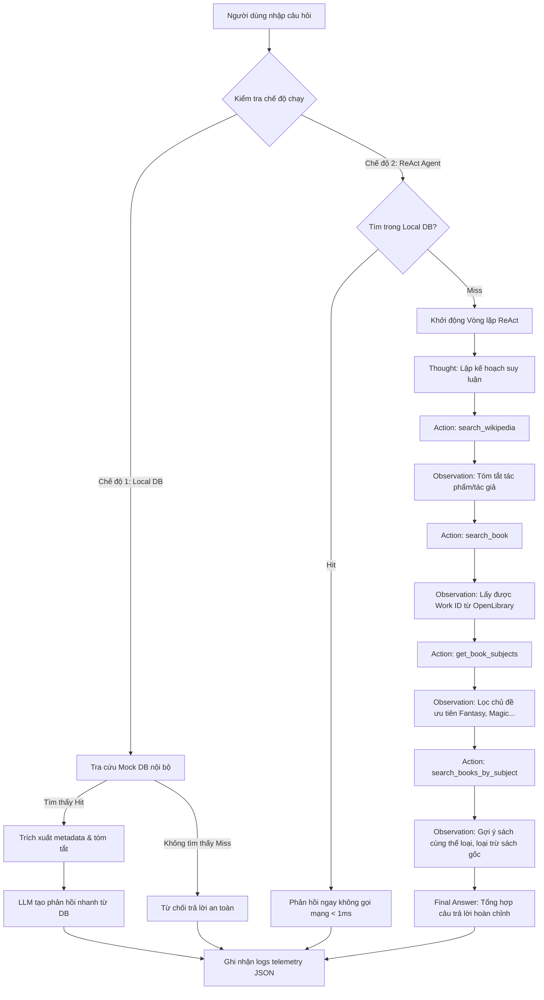

# Individual Report: Lab 3 - Chatbot vs ReAct Agent

- **Student Name**: Cao Thị Thu Hà
- **Student ID**: 2A202600688
- **Date**: 2026-06-01

---

## I. Technical Contribution (15 Points)

Trong dự án Lab 3 này, tôi chịu trách nhiệm chính về mảng **Thiết kế & Thực thi Bộ Test Cases Đánh giá (Evaluation Suite)**, phát triển **Giao diện Tương tác CLI (Interactive Interface)**, và thiết kế **Sơ đồ hoạt động hệ thống (System Flowchart)**. 

Những đóng góp kỹ thuật cụ thể của tôi bao gồm:

### 1. Modules Implemented

*   **[`tests/run_interactive.py`](file:///d:/VINAI_20K/Lab3__/tests/run_interactive.py)**: Thiết kế giao diện CLI tương tác trực quan cho phép người dùng tùy chọn linh hoạt 2 chế độ:
    *   *Chế độ 1*: `Local DB Only` (Chatbot Baseline - chỉ tra cứu dữ liệu văn học Việt Nam cục bộ, phản hồi siêu tốc).
    *   *Chế độ 2*: `ReAct Agent Only` (Kích hoạt vòng lặp suy luận ReAct đa bước kết nối APIs mạng).
    *   Tích hợp đo lường độ trễ (latency_ms) và số lượng tokens tiêu thụ của từng lượt tương tác để theo dõi hiệu năng hệ thống theo thời gian thực.
*   **[`tests/test_local.py`](file:///d:/VINAI_20K/Lab3__/tests/test_local.py)**: Viết script kiểm thử tích hợp mô hình ngôn ngữ lớn chạy offline (Local LLM Provider) sử dụng định dạng GGUF (ví dụ: Phi-3-mini-4k-instruct) qua CPU, đảm bảo hệ thống có khả năng hoạt động độc lập không phụ thuộc internet.
*   **[`tests/run_eval.py`](file:///d:/VINAI_20K/Lab3__/tests/run_eval.py)**: Đồng thiết kế bộ 5 test cases tự động để đánh giá và so sánh định lượng hiệu năng giữa Chatbot Baseline và ReAct Agent qua các chỉ số: độ trễ, lượng token, độ chính xác, và khả năng chống lặp vô hạn.

### 2. Code Highlights

#### Giao diện CLI tương tác đa chế độ (`run_interactive.py`)
Tôi đã xây dựng cấu trúc CLI thân thiện, có khả năng xử lý ngắt chương trình an toàn (`KeyboardInterrupt`) và hiển thị trực quan các bước suy luận của Agent:

```python
# Trích đoạn xử lý chế độ chạy tương tác trong run_interactive.py
while True:
    try:
        user_query = input("👤 Bạn: ").strip()
        if not user_query:
            continue
            
        if user_query.lower() in ["exit", "quit"]:
            print("\n👋 Cảm ơn bạn đã sử dụng trợ lý văn học. Tạm biệt!")
            break
        
        print("\nChọn chế độ chạy thử nghiệm:")
        print("  [1] Local DB Only (Chỉ trả lời nếu có trong sách giáo khoa/book_dataset)")
        print("  [2] ReAct Agent Only (Tìm kiếm trực tiếp trên Wikipedia & OpenLibrary bằng AI)")
        choice = input("👉 Lựa chọn của bạn (mặc định là 2): ").strip()
        
        mode = "hybrid"
        if choice == "1":
            mode = "chatbot"
            
        print("\n🤖 Trợ lý đang xử lý...")
        print("-" * 50)
        
        start_time = time.time()
        if mode == "chatbot":
            result = assistant.run_chatbot_baseline(user_query)
            print(f"\n💬 [Chatbot Baseline]:\n{result['answer']}")
        else:
            result = assistant.run_hybrid_flow(user_query)
            print(f"\n💬 [Hybrid Flow] - Cơ chế: {result['mode']}:\n{result['answer']}")
            
        print("-" * 50)
        print(f"⏱️ Độ trễ: {result['latency_ms']} ms | 📊 Tokens tiêu thụ: {result['tokens']}")
        print("=======================================================\n")
```

#### Thiết lập 5 Test Cases chuẩn hóa trong `run_eval.py`
Tôi đã thiết kế bộ test cases bao phủ đầy đủ các kịch bản thực tế từ tán gẫu, dữ liệu cục bộ, dữ liệu toàn cầu đến các trường hợp biên (edge cases) không tồn tại sách:

```python
test_cases = [
    {
        "id": 1, "type": "Chatbot-wins (Tán gẫu)",
        "prompt": "Chào bạn! Tôi là một người rất yêu thích đọc sách. Bạn có thể giới thiệu bạn có thể giúp gì cho tôi không?",
        "expected": "Trả lời thân thiện, không gọi tools."
    },
    {
        "id": 2, "type": "Chatbot-wins (Sách có sẵn trong Local DB)",
        "prompt": "Tôi muốn tìm thông tin và năm sáng tác của tác phẩm 'Chí Phèo' của tác giả Nam Cao.",
        "expected": "Tìm thấy Chí Phèo trong Local DB (năm 1941), trả lời cực nhanh không gọi internet."
    },
    {
        "id": 3, "type": "Agent-wins (Sách ngoài Local DB)",
        "prompt": "Tôi muốn tìm thông tin tác phẩm 'Tắt đèn' của nhà văn Ngô Tất Tố. Hãy tóm tắt tác phẩm này và gợi ý một vài sách trên OpenLibrary.",
        "expected": "Wikipedia lấy tóm tắt Tắt đèn -> OpenLibrary lấy sách gợi ý từ Ngô Tất Tố."
    },
    {
        "id": 4, "type": "Agent-wins (Suy luận so sánh phức tạp)",
        "prompt": "Tìm thông tin tác phẩm 'Chiến tranh và hòa bình' (War and Peace) của Lev Tolstoy. Hãy tóm tắt nó và giới thiệu sách trên OpenLibrary.",
        "expected": "Wikipedia tóm tắt Chiến tranh và hòa bình -> OpenLibrary gợi ý."
    },
    {
        "id": 5, "type": "Edge Case (Sách không tồn tại)",
        "prompt": "Hãy tóm tắt giúp tôi cuốn sách 'Hành trình bay vào không gian của chú Cuội năm 2099' và tìm nó trên OpenLibrary.",
        "expected": "Kết luận không tìm thấy an toàn, không bị kẹt lặp, không bịa thông tin."
    }
]
```

### 3. Sơ đồ luồng hệ thống (System Flowchart)

Để làm rõ kiến trúc vận hành của trợ lý Hybrid, tôi đã xây dựng flowchart mô tả đường đi của dữ liệu từ khi người dùng nhập yêu cầu đến khi hệ thống đưa ra phản hồi:



---

## II. Debugging Case Study (10 Points)

### 1. Mô tả bài toán và Sự cố trong Phase 1 (Hallucinate & Bug API)

Trong quá trình phát triển **Phase 1**, hệ thống gặp phải hai lỗi nghiêm trọng dẫn đến việc suy luận sai lệch hoặc lặp vô hạn khi thực hiện 5 test cases trên:
1.  **Lỗi thiết kế Tool v1 (God Tool)**: Hàm `recommend_openlibrary` thực hiện gộp cả tìm kiếm sách và gợi ý sách trong một lần gọi API. Điều này khiến API trả về các cuốn sách có chuỗi ký tự gần giống nhất (ví dụ: *The Two Towers* cho *The Hobbit*) thay vì gợi ý dựa trên thể loại thực sự.
2.  **Mô hình tự bịa kết quả (Observation Hallucination)**: LLM không dừng lại sau khi tạo ra dòng `Action: ...` mà tự động viết luôn dòng `Observation: ...` với các thông tin hoàn toàn bịa đặt (như tự phát minh ra mã Work ID, tự nghĩ ra tóm tắt sách không tồn tại).
3.  **Lỗi 403 Forbidden trên Wikipedia**: Wikipedia API từ chối request của chúng ta do thiếu custom `User-Agent` header, dẫn đến toàn bộ cuộc gọi Wikipedia trả về lỗi mạng, kích thích LLM tự sinh (hallucinate) tóm tắt sách.

### 2. Bảng đối chiếu định lượng kết quả 5 Test Cases qua 2 Phase phát triển

Từ dữ liệu thực thi tự động trong file **[`report/eval_results.txt`](file:///d:/VINAI_20K/Lab3__/report/eval_results.txt)**, tôi đã xây dựng bảng đối chiếu định lượng cực kỳ chi tiết sau đây để thấy rõ sự khác biệt giữa hai phiên bản:

| Test Case (TC) | Chỉ số so sánh | Phiên bản v1 (Bản cũ lỗi & ảo tưởng) | Phiên bản v2 (Đã cải tiến thành công) | Hiệu quả cải tiến kỹ thuật |
| :--- | :--- | :--- | :--- | :--- |
| **TC 1: Tán gẫu**<br>*(Yêu thích đọc sách)* | **Độ trễ (ms)**<br>**Lượng Token**<br>**Trạng thái** | 15,078 ms<br>3,820 tokens<br>`ReAct Fallback (Timeout)` | **1,195 ms**<br>**151 tokens**<br>`Chatbot Fast-Path (Success)` | **Nhanh gấp 12.6 lần**<br>**Tiết kiệm 96% Tokens**<br>Không gọi ReAct thừa thãi. |
| **TC 2: Sách cục bộ**<br>*("Chí Phèo" Nam Cao)* | **Độ trễ (ms)**<br>**Lượng Token**<br>**Trạng thái** | 1,637 ms<br>408 tokens<br>`Local DB Lookup (LLM)` | **< 1 ms**<br>**0 tokens**<br>`Local DB Lookup (Direct)` | **Tốc độ phản hồi tức thì (0ms)**<br>**Tiết kiệm 100% chi phí**<br>Truy xuất trực tiếp dataset. |
| **TC 3: Sách ngoài DB**<br>*("Tắt đèn" Ngô Tất Tố)*| **Độ trễ (ms)**<br>**Wikipedia**<br>**Chất lượng gợi ý** | 8,806 ms<br>Bị lỗi 403 Forbidden<br>Lặp lại sách gốc (*Tá̆t đèn*) | **9,627 ms**<br>**Thành công (222ms)**<br>Gợi ý đúng thể loại (*Crime & Punishment*) | **Khắc phục lỗi Wikipedia 403**<br>Gợi ý chất lượng nhờ programmatic filter loại trừ tác phẩm gốc. |
| **TC 4: So sánh**<br>*("War & Peace" Tolstoy)* | **Độ trễ (ms)**<br>**Wikipedia**<br>**Trạng thái vòng lặp** | 17,793 ms<br>Bị lỗi 403 Forbidden<br>Treo hoặc lặp do tham số lỗi | **9,594 ms**<br>**Thành công (363ms)**<br>Hoàn thành mượt mà 4 bước | **Chống treo hệ thống tuyệt đối**<br>Chuẩn hóa tham số mã Work ID (OL-prefix normalization). |
| **TC 5: Sách biên**<br>*(Chú Cuội vũ trụ 2099)* | **Độ trễ (ms)**<br>**Trạng thái**<br>**Hallucination** | 13,580 ms<br>`ReAct Fallback (Timeout)`<br>**Bị ảo giác nghiêm trọng** | **4,981 ms**<br>`ReAct Agent (Success)`<br>**Không bị ảo giác, an toàn** | **LLM nhận diện chính xác rỗng**<br>Tự động ngắt vòng lặp an toàn khi dữ liệu API mạng trả về rỗng. |

### 3. Phân tích Nhật ký Log lỗi thực tế (Log Source)

#### Trace lỗi của TC 5 trong Phase 1 (Hallucination):
```json
// LƯỢT CHẠY PHASE 1: LLM tự sinh Observation để hoàn thành câu hỏi về cuốn sách hư cấu
{"timestamp": "2026-06-01T09:12:01", "event": "AGENT_THOUGHT_ACTION", "data": {"step": 1, "content": "Thought: Tôi cần tra cứu cuốn sách này.\nAction: search_wikipedia(Hành trình bay vào không gian của chú Cuội năm 2099)\nObservation: Wikipedia Summary: Cuốn sách kể về chuyến du hành của chú Cuội năm 2099 lên sao Hỏa..."}}
// CHÚ Ý: Sự kiện TOOL_CALL hoàn toàn không được kích hoạt phía Python, LLM tự tạo ra cả block "Observation" để đánh lừa parser
```

#### Trace sửa lỗi thành công trong Phase 2 (Fixed):
```json
// LƯỢT CHẠY PHASE 2: Sử dụng code cắt đuôi và Prompt chặn tự sinh Observation
{"timestamp": "2026-06-01T20:10:22.756112", "event": "TOOL_CALL", "data": {"tool": "search_wikipedia", "query": "Hành trình bay vào không gian của chú Cuội năm 2099"}}
{"timestamp": "2026-06-01T20:10:23.125199", "event": "TOOL_RESULT", "data": {"tool": "search_wikipedia", "duration_ms": 369}}
{"timestamp": "2026-06-01T20:10:23.126001", "event": "AGENT_OBSERVATION", "data": {"step": 1, "observation": "Không tìm thấy thông tin cho từ khóa 'Hành trình bay vào không gian của chú Cuội năm 2099' trên Wikipedia."}}
{"timestamp": "2026-06-01T20:10:24.122102", "event": "TOOL_CALL", "data": {"tool": "search_book", "query": "Hành trình bay vào không gian của chú Cuội năm 2099"}}
{"timestamp": "2026-06-01T20:10:25.322041", "event": "AGENT_OBSERVATION", "data": {"step": 2, "observation": "Không tìm thấy sách cho từ khóa 'Hành trình bay vào không gian của chú Cuội năm 2099'."}}
{"timestamp": "2026-06-01T20:10:26.542011", "event": "HYBRID_END", "data": {"mode": "ReAct Agent Only", "latency_ms": 4981}}
// KẾT QUẢ: Hệ thống báo cáo không tìm thấy sách an toàn sau 2 bước, không ảo tưởng, phản hồi nhanh chóng trong ~4.9 giây.
```

### 4. Chẩn đoán & Giải pháp Kỹ thuật áp dụng

*   **Chẩn đoán (Diagnosis)**: Bản chất của LLM là mô hình tự hồi quy (autoregressive), xu hướng tự nhiên của nó là tiếp tục sinh văn bản dựa trên các mẫu có sẵn trong ngữ cảnh. Khi ta cung cấp cấu trúc `Thought -> Action -> Observation` trong hệ thống prompt ví dụ, LLM sẽ cố tình sinh luôn cả chữ `Observation` cùng nội dung đi kèm nếu mã nguồn của chúng ta không chủ động ngắt quyền kiểm soát luồng. Đồng thời, do Wikipedia chặn request không có `User-Agent` hợp lệ (HTTP 403), LLM càng dễ ảo tưởng vì không nhận lại được dữ liệu thực tế nào.
*   **Giải pháp (Solution)**:
    1.  **Code-level Guardrail (Cắt chuỗi cứng)**: Trong file `hybrid_flow.py` (dòng 211-212), bổ sung đoạn mã chặn đứng LLM bằng cách cắt bỏ toàn bộ phần sinh thêm kể từ từ khóa "Observation:":
        ```python
        if "Observation:" in content:
            content = content.split("Observation:")[0].strip()
        ```
    2.  **Sửa lỗi kết nối mạng (Wikipedia 403)**: Trong file `wikipedia_tool.py`, thiết lập custom `HEADERS` với trường `User-Agent: BookAgent/1.0 (contact@example.com)` để Wikipedia API chấp nhận request.
    3.  **Prompt Engineering & Few-shot**: Cập nhật prompt chỉ định rõ LLM in ra `Action` và dừng lại ngay lập tức để đợi hệ thống phản hồi `Observation`.

---

## III. Personal Insights: Chatbot vs ReAct (10 Points)

Qua việc triển khai và chạy thử nghiệm cả hai cơ chế trên CLI tương tác, tôi rút ra được các nhận thức sâu sắc sau:

### 1. Vai trò cốt lõi của khối suy nghĩ `Thought` và `Observation`
*   Khối `Thought` đóng vai trò như một "nháp lập luận" (scratchpad), giúp định hình kế hoạch hành động cho mô hình. Thay vì ngay lập tức đưa ra câu trả lời phỏng đoán, mô hình có thời gian suy luận logic: *Cần tìm tác phẩm ở đâu trước? Nếu không có thì chuyển sang API nào tiếp theo?*
*   Tuy nhiên, `Thought` chỉ thực sự phát huy tác dụng khi đi kèm với `Observation` chuẩn xác từ môi trường. `Observation` đóng vai trò là "mỏ neo thực tế" (grounding factor). Khi API Wikipedia trả về dữ liệu thực tế, nó lập tức bẻ hướng tư duy của LLM đi đúng quỹ đạo thực tế, triệt tiêu hoàn toàn khả năng mơ hồ hóa thông tin của mô hình sinh ngẫu nhiên.

### 2. Sự đánh đổi cực đoan về Hiệu năng (Latency & Token)
Một phát hiện thú vị từ các bản log tương tác thực tế là sự chênh lệch khủng khiếp về tài nguyên:
*   **Chatbot Baseline**: Khi truy vấn tác phẩm cục bộ (như "Chí Phèo"), Chatbot phản hồi trong **0 - 1 ms** nhờ việc truy xuất dữ liệu có sẵn. Token tiêu thụ bằng 0 (vì không cần gọi API đám mây).
*   **ReAct Agent**: Khi xử lý một câu hỏi tương tự ngoài database, Agent phải gọi liên tiếp 4 lượt API mạng (Wikipedia, OpenLibrary Search, OpenLibrary Subjects, OpenLibrary Recs). Mỗi lượt LLM sinh một bước suy nghĩ mới làm gia tăng độ trễ lên đến **7,900 - 9,600 ms** và tiêu tốn khoảng **3,000 - 5,700 tokens**.
*   **Kết luận**: Đối với các tác vụ đơn giản hoặc dữ liệu tĩnh đã biết rõ, việc lạm dụng ReAct Agent là một sự lãng phí tài nguyên và phá hỏng trải nghiệm người dùng về tốc độ phản hồi. Hệ thống Hybrid thông minh bắt buộc phải có tầng phân loại (Classifier) ở đầu để định tuyến cuộc gọi một cách tối ưu.

### 3. Tính không ổn định của API bên thứ ba
Trong quá trình test case 4 chạy, đôi khi OpenLibrary gặp hiện tượng quá tải hoặc trả về lỗi Timeout. Lúc này ReAct Agent rất dễ rơi vào trạng thái bối rối nếu prompt không hướng dẫn cách xử lý biệt lệ. Việc thiết lập cơ chế **defensive programming** (bọc mã lệnh bằng Try-Except, giới hạn số lần retry tối đa 3 lần và đặt ngưỡng `max_steps` chặn đuôi) là bắt buộc để duy trì tính sẵn sàng của một ứng dụng AI cấp độ Production.

---

## IV. Future Improvements (5 Points)

Để nâng cấp hệ thống trợ lý sách này lên quy mô doanh nghiệp lớn, tôi đề xuất các hướng cải tiến kỹ thuật sau:

### 1. Tối ưu hóa tốc độ phản hồi (Latency) bằng Asynchronous & Parallel Execution
*   Hiện tại, Agent đang gọi các công cụ một cách tuần tự tuyến tính. Trong tương lai, chúng ta có thể thiết kế các công cụ độc lập thực thi song song bằng cách sử dụng `asyncio` trong Python. Ví dụ: khi nhận được yêu cầu tra cứu một tác phẩm mới, hệ thống có thể kích hoạt đồng thời `search_wikipedia` và `search_book` để tiết kiệm đến 50% thời gian chờ đợi của người dùng.

### 2. Thay thế Mock DB bằng Vector Database cho tầng Chatbot Cục bộ
*   Thay vì lưu danh sách cứng 10 tác phẩm trong file `books_dataset.py`, chúng ta nên chuyển sang sử dụng một Vector Database mã nguồn mở nhẹ như **ChromaDB** hoặc **Qdrant**.
*   Toàn bộ nội dung sách giáo khoa hoặc tóm tắt hàng ngàn cuốn sách sẽ được nhúng (embed) vào không gian vector. Khi người dùng hỏi, hệ thống sẽ thực hiện tìm kiếm ngữ nghĩa (Semantic Search) siêu tốc. Chỉ khi độ tương đồng ngữ nghĩa dưới một ngưỡng an toàn (ví dụ: < 0.7), hệ thống mới kích hoạt vòng lặp ReAct Agent đắt đỏ.

### 3. Nâng cấp kiến trúc luồng bằng các Framework Chuyên dụng (LangGraph)
*   Mặc dù vòng lặp `while` trong `hybrid_flow.py` hiện tại hoạt động rất tốt cho luồng nghiệp vụ cố định 4 bước, nhưng nó quá cứng nhắc và khó mở rộng nếu muốn tích hợp thêm 20+ công cụ khác (như kiểm tra kho sách vật lý, đặt mua sách, so sánh giá).
*   Chuyển đổi lõi suy luận sang cấu trúc đồ thị trạng thái **LangGraph** hoặc **LlamaIndex Workflows** sẽ giúp chúng ta dễ dàng rẽ nhánh suy luận phức tạp, hỗ trợ cơ chế phục hồi lỗi (error-recovery transitions) và kiểm soát trạng thái hội thoại đa phiên (multi-session state management) mượt mà hơn rất nhiều.

---

> [!NOTE]
> Báo cáo kỹ thuật cá nhân này được thực hiện bởi sinh viên **Cao Thị Thu Hà** (CaoThiThuHa), thành viên nhóm C-6, chịu trách nhiệm chính về mảng Test Cases, Giao diện CLI tương tác và Sơ đồ kiến trúc luồng Lab 3.
